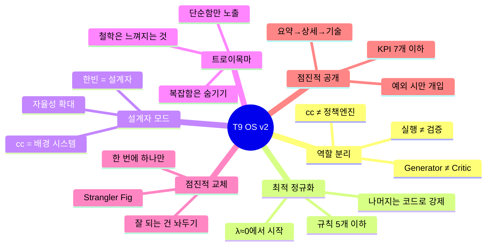
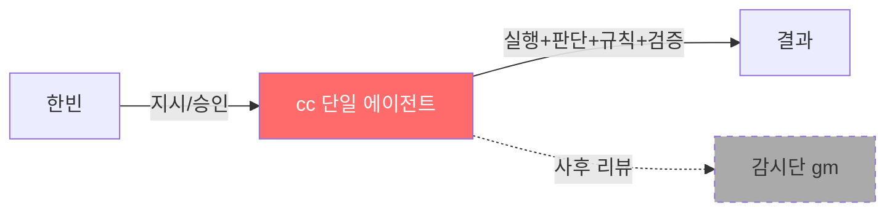
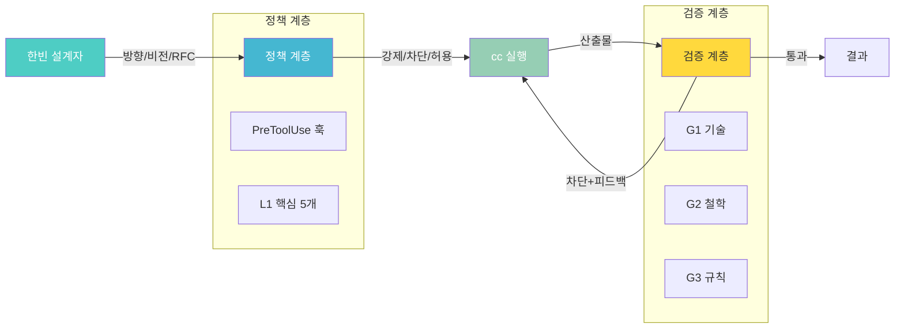
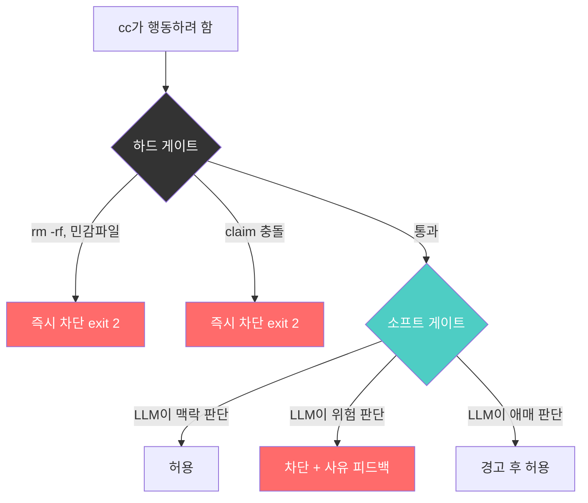
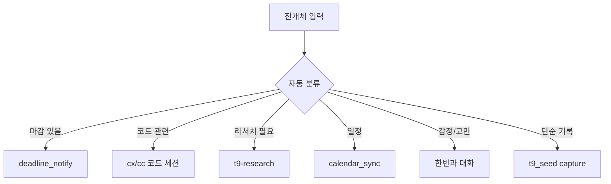
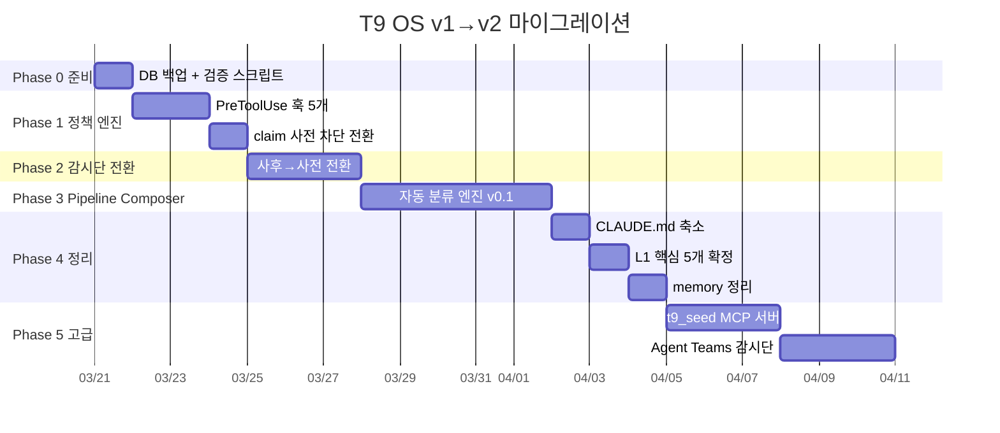
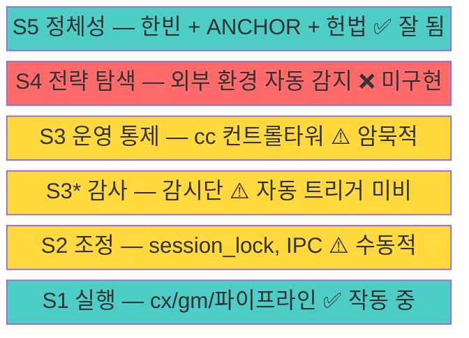

# T9 OS v2 기획서
# "설계자의 운영체제"
# 작성: 2026-03-20 (cc)
# 상태: v1.0 완성 (한빈 리뷰 대기)

---

## 한 문장 요약

> T9 OS v2는 한빈의 삶 전체를 자율 운영하는 시스템으로, "cc에게 규칙을 말하는 것"에서 "cc 밖에서 구조로 강제하는 것"으로 전환한다.

---

## 1. 왜 v2가 필요한가

### v1의 성과
- 524개 엔티티 관리, 37% 완료율
- SSK 논문 v25 완성, ODNAR MVP 배포, AT1 본선 진출
- 16개 파이프라인 가동, 감시단 G1~G7 운영
- 시몽동 기반 철학 체계 확립

### v1의 한계
- **cc가 전부 혼자**: 실행+판단+규칙준수+검증 = 구조적 실패
- **규칙 과다**: 54개 규칙, 54개 memory = 과도한 정규화(λ) = 시스템 경직
- **단일 에이전트 규칙 준수율 48%**: 프롬프트의 문제가 아니라 아키텍처의 문제
- **247개 전개체 적체**: Pipeline Composer 미구현 → 수동 라우팅 병목
- **감시단 사후 리뷰**: 이미 저지른 뒤 발견 → 예방 불가

### 한빈의 비전
> "나는 주인공이 아니고 설계자다. 설계자는 작품 앞에 드러나지 않는다."
>
> "인간의 판단이 들어가야 한다는 것 자체가 사고의 한계."
>
> "삼성 이재용이 전부 보고 받는 게 아니잖아. 방향성을 잡는 거잖아."

---

## 2. 설계 원칙



---

## 3. 아키텍처: v1 vs v2

### v1 (현재)


### v2 (목표)


### 4개 계층 상세

| 계층 | 역할 | 구현 | 한빈 비유 |
|------|------|------|-----------|
| **한빈 계층** | 방향, 비전, 최종 승인 | 대시보드 + 텔레그램 + RFC | CEO |
| **정책 계층** | L1 핵심 규칙 물리적 강제 | PreToolUse 훅 (deterministic) | 법률/헌법 |
| **실행 계층** | 코드, 문서, 분석, 오케스트레이션 | cc + cx + gm (현행 3인 유지) | 실무팀 |
| **검증 계층** | 사전/사후 검증 | Agent Teams critic + 감시단 | 감사팀 |

---

## 4. 핵심 변경 사항

### 4-1. 정책 엔진 — 2층 구조 (가장 중요한 변경)

**현재**: CLAUDE.md에 규칙 54개 → cc가 읽지만 안 지킴 (advisory, 죽어있음)
**v2**: 2층 정책 엔진 — 죽은 것과 살아있는 것을 분리



#### 하드 게이트 (물리 법칙 — 죽어있어도 됨)

`type: command` (셸 스크립트). 바뀔 필요 없는 절대적 차단:

1. `rm -rf`, `git push --force` 등 위험 명령 차단
2. 다른 세션이 claim한 파일 수정 차단
3. `_keys/`, `.env` 등 민감 파일 접근 차단

이것들은 **물리 법칙**이야. "rm -rf를 맥락에 따라 허용해야 할 때"는 없어. 정적이어도 됨.

#### 소프트 게이트 (법률/판례 — 살아있어야 함)

`type: prompt` 또는 `type: agent` (별도 LLM이 판단). 맥락에 따라 달라지는 것:

1. **Build vs Buy 판단**: "이 작업을 직접 만들어야 하나, 외부 도구를 써야 하나?"
2. **철학 정합성**: "이 변경이 T9OS 헌법/ANCHOR에 부합하는가?"
3. **커밋 전 검증**: "이 변경의 품질이 충분한가?"
4. **배포 전 감시단**: "감시단 통과가 필요한 수준의 변경인가?"
5. **토큰/자원 판단**: "지금 이 작업에 토큰을 더 쓸 가치가 있는가?"

이것들은 **법률/판례**야. 삼성 법무팀처럼 맥락을 읽고, 과거 사례를 참고하고, 상황에 맞게 판단해야 해. 살아있어야 하는 이유:
- 같은 행동이라도 프로젝트/시급성에 따라 판단이 달라짐
- 과거 감시단 결과가 쌓이면 판단이 더 정교해짐
- 새로운 상황(새 프로젝트, 새 도구)에도 대응 가능

```
예시: cc가 python-pptx로 PPT를 만들려 함
  → 하드 게이트: 통과 (위험 명령 아님)
  → 소프트 게이트 (prompt 핸들러):
    "이 작업은 Build에 해당합니다.
     과거 피드백: 'PPT/디자인은 Buy(Gamma/Canva)로' (2026-03-20)
     차단합니다. Gamma 사용을 권장합니다."
  → cc에게 피드백 반환, 방향 전환
```

#### 나머지 49개 규칙

삭제하거나 memory/L2로 격하 (advisory). 소프트 게이트의 LLM이 필요 시 참조하되, cc에게 직접 주입하지 않음.

### 4-2. 감시단 전환 (사후 → 사전)

**현재**: cc가 작업 완료 → gm_batch.py 사후 리뷰 → 문제 발견 → 이미 늦음
**v2**: cc가 커밋/배포 시도 → 감시단 사전 검증 → 통과해야 실행

구현: Agent Teams의 `TaskCompleted` 훅 또는 PreToolUse `prompt` 핸들러

### 4-3. Pipeline Composer (247개 적체 해소)

**현재**: 전개체가 inbox에 들어오면 → cc가 수동으로 판단 → 어디로 보낼지 결정
**v2**: 전개체 도착 → 자동 분류 → 적절한 파이프라인으로 라우팅



### 4-4. CLAUDE.md 축소

**현재**: ~300줄, 규칙/파이프라인/로깅/환경 전부 포함
**v2**: ~100줄. 핵심만. 나머지는 코드/훅/MCP로 이동

### 4-5. t9_seed MCP 서버

**현재**: `python3 T9OS/t9_seed.py capture "텍스트"` (Bash 경유)
**v2**: cc가 도구로 직접 호출 (MCP)

```json
{
  "mcpServers": {
    "t9-seed": {
      "command": "python3",
      "args": ["T9OS/mcp/t9_seed_server.py"]
    }
  }
}
```

---

## 5. 마이그레이션 전략

### 전략: Strangler Fig + Feature Flags

> "전면 재작성 하지 마라. 잘 되는 건 놔두고 문제만 교체." — Discord/Stripe 교훈



### 안전 규칙
1. **한 번에 한 모듈만** 교체
2. **매 Phase 시작 전** `.t9.db` 백업
3. **v1 코드 2주 공존** 후 퇴역
4. **스키마 변경과 기능 추가 절대 동시 금지**
5. **검증 자동화**: 엔티티 수, FTS, 위상 분포 자동 비교

---

## 6. 성공 지표

| 지표 | v1 현재 | v2 목표 | 측정 방법 |
|------|---------|---------|-----------|
| 규칙 준수율 | ~48% (추정) | 90%+ | PreToolUse 차단 로그 |
| 전개체 적체 | 247개 | <50개 | t9_seed.py status |
| 한빈 개입 필요 | 매 작업마다 | 예외 시만 | 세션당 한빈 메시지 수 |
| 감시단 P0 사전 차단 | 0% (사후 발견) | 80%+ | 감시단 로그 |
| CLAUDE.md 크기 | ~300줄 | <100줄 | wc -l |
| 세션 시작 토큰 | ~95K (MCP) + 규칙 | <30K | /mcp 진단 |

---

## 7. 한빈이 결정해야 할 것

### 결정 1: 정책 엔진 범위
- A) 핵심 5개만 강제 (최소 정규화, λ≈0)
- B) 핵심 5개 + 감시단 사전 검증 (중간 정규화)
- C) 모든 L1 규칙 강제 (최대 정규화, v1과 유사)

> cc 권장: **A**에서 시작, 문제 발생 시 점진적으로 B로 확대

### 결정 2: 감시단 실행 시점
- A) 커밋 전에만 (빠르지만 중간 과정 미검증)
- B) 주요 파일 수정마다 (안전하지만 느림)
- C) 배포 전에만 (최소 개입)

> cc 권장: **A** (커밋 전)

### 결정 3: 마이그레이션 시작 시점
- A) 지금 바로 (이 세션에서 Phase 0~1)
- B) AT1 본선(4/4) 이후
- C) 기획서 한빈 리뷰 후

> cc 권장: **C** — 기획서 리뷰 → 수정 → 실행

---

## 8. 구조적 동형성 — 다른 분야에서 빌려온 설계

### T9 OS 4계층을 6개 분야로 검증

```
T9 OS v2      정치학        군사학         생물학        경영학(VSM)     생태학
─────────────────────────────────────────────────────────────────────────────
한빈(설계자)  헌법/국민      최고사령관     DNA/유전자    S5 정체성       여왕벌
정책 계층     입법부        Commander's   설정점        S5+S4          정족수 규칙
                           Intent       (Setpoint)
실행 계층     행정부        Auftragstaktik 교감신경     S1 실행        개미 작업자
                           현장 재량     (가속)        +S3 운영
검증 계층     사법부        OODA Observe  면역계        S3* 감사       정지 신호
                           (결과 관찰)   (자기/비자기)                 (cross-inhibition)
```

### VSM(Viable System Model) — 가장 높은 동형성

Beer의 5개 시스템 중 T9 OS v1에서 **S4(전략적 환경 탐색)가 가장 약한 고리**:



**Beer의 경고**: "S3와 S4의 균형이 깨지면 조직이 죽는다." S3(내부 최적화)만 강하면 현재에 매몰, S4(외부 탐색)만 강하면 실행 없이 탐색만. **v2에서 S4를 구축해야 한다.**

### OODA 루프 — Orient가 핵심

Boyd의 통찰: OODA의 핵심은 Act가 아니라 **Orient(판단 틀)**. T9 OS에서 Orient = 세션 시작 시 컨텍스트 로드인데, **작업 중 연속적 재판단이 없다.** 긴급 전개체가 들어왔을 때 현재 작업을 중단할지 결정하는 메커니즘 필요.

### Auftragstaktik(임무형 지휘) — Commander's Intent

**"상급자는 What과 Why만, How는 현장 재량."**

v2에서 모든 작업에 3줄 표준화:
```
INTENT: [이 작업의 최종 목적 — "왜"]
CONSTRAINTS: [절대 하면 안 되는 것]
FREEDOM: [이 범위 안에서는 자유롭게 판단]
```

### 자율신경계 — 가속과 제동의 항시 작동

현재 T9 OS에는 **가속 편향** 있음. 실행 에이전트는 항상 작동하지만 감시단은 cc가 기억해야 실행. 생물학적 자율신경계는 **교감(가속)과 부교감(제동)이 항상 동시 작동**. 감시단을 훅에 자동 부착하면 "항시 작동하는 부교감신경"이 됨.

### 스티그머지(개미) — 환경 기반 간접 통신

T9 OS가 이미 무의식적으로 사용 중. WORKING.md, state.md = 페로몬 트레일. IPC(직접 통신)보다 **환경 수정(간접 통신)이 더 견고** — 한 세션이 죽어도 파일에 흔적이 남기 때문.

### 벌 떼 — 가변 정족수

감시단에 정족수(quorum) 도입: **변경 중요도에 따라 필요한 감시단 수가 다름.**
- 문서 수정 → G1만 통과
- 코드 커밋 → G1+G3 통과
- 배포 → G1+G2+G3 전원 통과

---

## 부록: 리서치 근거

상세 리서치 결과는 `T9OS/artifacts/T9OS_V2_RESEARCH_SYNTHESIS.md` 참조.

### 핵심 출처
- PCAS: 규칙 준수율 48%→93% (arXiv 2602.16708)
- DeepMind: 비구조적 에이전트 오류 17.2x 증폭 (2025.12)
- Claude Code Hooks: 25개 이벤트, PreToolUse 입력 수정 (공식 문서)
- Agent Teams: Lead-Teammate 아키텍처 (2026.02)
- Strangler Fig: Martin Fowler 2024 개정판
- C4 Model: Simon Brown 4단계 추상화
- 한빈 사고지도: 7테마 사고 진화, 236개 인사이트

---

*이 문서는 한빈의 리뷰와 피드백에 따라 진화한다.*
*철학은 숨기고 직관만 노출한다. 복잡함은 cc가 관리한다.*
