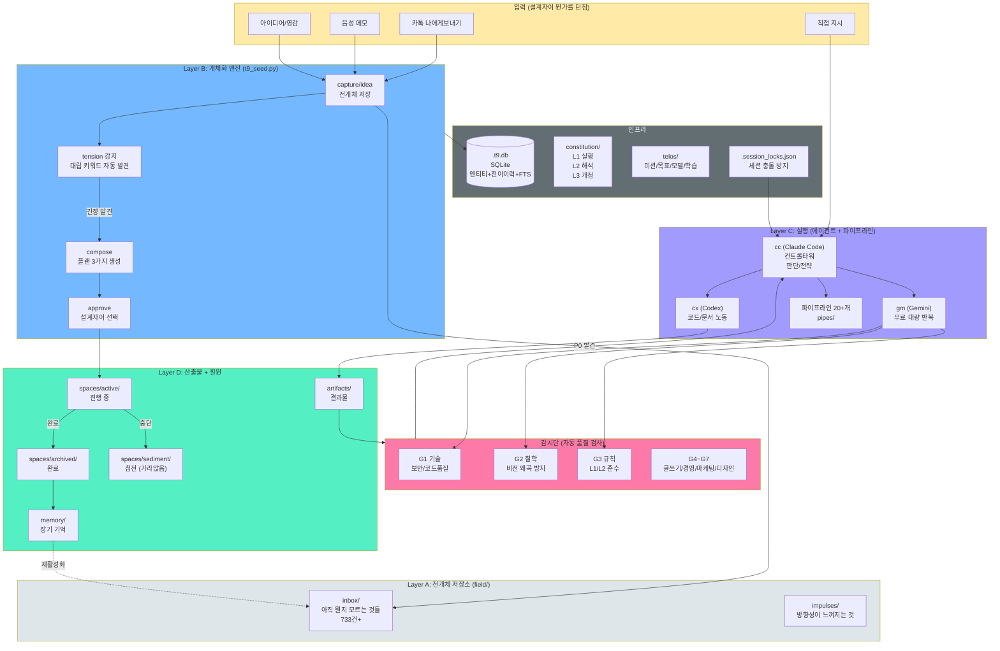
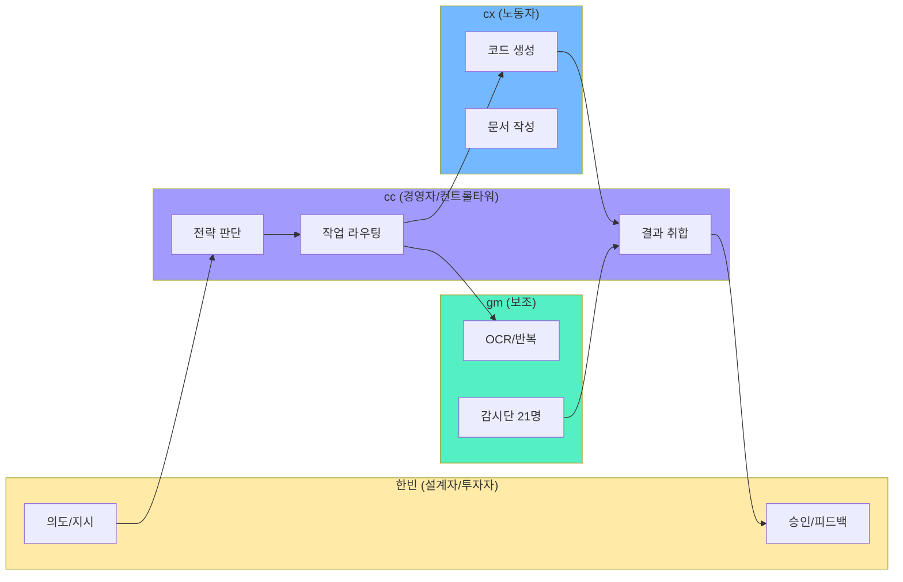
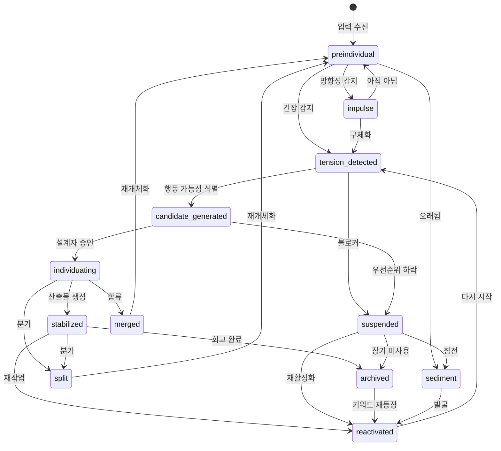
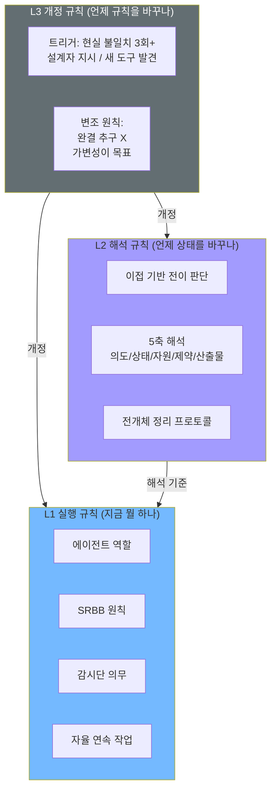
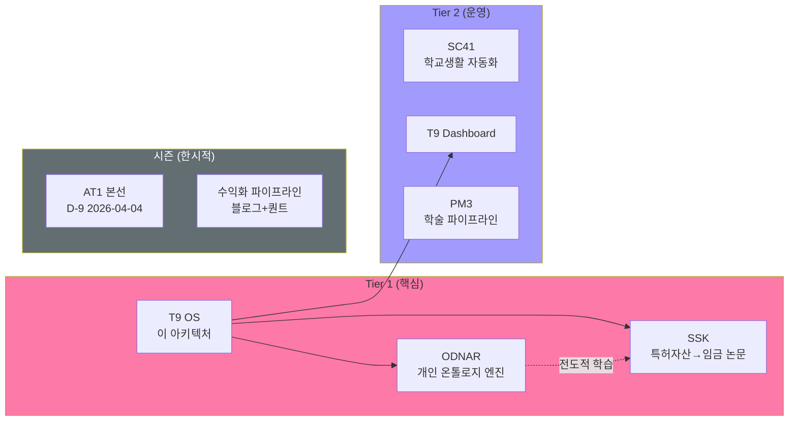

# T9 OS 시스템맵

> 설계자가 기술 배경 없이도 한눈에 볼 수 있는 전체 그림. (2026-03-26 갱신)

## 전체 흐름

```mermaid
graph TB
    subgraph INPUT["입력 (설계자이 뭔가를 던짐)"]
        카톡["카톡 나에게보내기"]
        음성["음성 메모"]
        영감["아이디어/영감"]
        지시["직접 지시"]
    end

    subgraph FIELD["Layer A: 전개체 저장소 (field/)"]
        inbox["inbox/<br/>아직 뭔지 모르는 것들<br/>733건+"]
        impulses["impulses/<br/>방향성이 느껴지는 것"]
    end

    subgraph ENGINE["Layer B: 개체화 엔진 (t9_seed.py)"]
        capture["capture/idea<br/>전개체 저장"]
        tension["tension 감지<br/>대립 키워드 자동 발견"]
        compose["compose<br/>플랜 3가지 생성"]
        approve["approve<br/>설계자이 선택"]
    end

    subgraph WORK["Layer C: 실행 (에이전트 + 파이프라인)"]
        cc["cc (Claude Code)<br/>컨트롤타워<br/>판단/전략"]
        cx["cx (Codex)<br/>코드/문서 노동"]
        gm["gm (Gemini)<br/>무료 대량 반복"]
        pipes["파이프라인 20+개<br/>pipes/"]
    end

    subgraph GUARD["감시단 (자동 품질 검사)"]
        G1["G1 기술<br/>보안/코드품질"]
        G2["G2 철학<br/>비전 왜곡 방지"]
        G3["G3 규칙<br/>L1/L2 준수"]
        G4G7["G4~G7<br/>글쓰기/경영/마케팅/디자인"]
    end

    subgraph OUTPUT["Layer D: 산출물 + 환원"]
        artifacts["artifacts/<br/>결과물"]
        active["spaces/active/<br/>진행 중"]
        memory["memory/<br/>장기 기억"]
        archived["spaces/archived/<br/>완료"]
        sediment["spaces/sediment/<br/>침전 (가라앉음)"]
    end

    subgraph INFRA["인프라"]
        db[(".t9.db<br/>SQLite<br/>엔티티+전이이력+FTS")]
        constitution["constitution/<br/>L1 실행<br/>L2 해석<br/>L3 개정"]
        telos["telos/<br/>미션/목표/모델/학습"]
        lock[".session_locks.json<br/>세션 충돌 방지"]
    end

    %% 흐름
    카톡 --> capture
    음성 --> capture
    영감 --> capture
    지시 --> cc

    capture --> inbox
    capture --> tension
    tension -->|긴장 발견| compose
    compose --> approve
    approve --> active

    cc --> cx
    cc --> gm
    cc --> pipes
    cx --> artifacts
    gm --> G1
    gm --> G2
    gm --> G3

    active -->|완료| archived
    active -->|중단| sediment
    archived --> memory
    memory -.->|재활성화| inbox

    %% 감시단
    artifacts --> GUARD
    GUARD -->|P0 발견| cc

    %% 인프라 연결
    ENGINE --> db
    lock --> cc

    %% 스타일
    style INPUT fill:#ffeaa7
    style FIELD fill:#dfe6e9
    style ENGINE fill:#74b9ff
    style WORK fill:#a29bfe
    style GUARD fill:#fd79a8
    style OUTPUT fill:#55efc4
    style INFRA fill:#636e72,color:#fff
```

## 에이전트 역할 분담

```mermaid
graph LR
    subgraph 설계자["한빈 (설계자/투자자)"]
        의도["의도/지시"]
        승인["승인/피드백"]
    end

    subgraph cc["cc (경영자/컨트롤타워)"]
        판단["전략 판단"]
        라우팅["작업 라우팅"]
        취합["결과 취합"]
    end

    subgraph cx["cx (노동자)"]
        코드["코드 생성"]
        문서["문서 작성"]
    end

    subgraph gm["gm (보조)"]
        OCR["OCR/반복"]
        감시["감시단 21명"]
    end

    의도 --> 판단
    판단 --> 라우팅
    라우팅 --> 코드
    라우팅 --> OCR
    코드 --> 취합
    감시 --> 취합
    취합 --> 승인

    style 설계자 fill:#ffeaa7
    style cc fill:#a29bfe
    style cx fill:#74b9ff
    style gm fill:#55efc4
```

## 상태 전이 (엔티티 생명주기)

```mermaid
stateDiagram-v2
    [*] --> preindividual: 입력 수신
    preindividual --> impulse: 방향성 감지
    preindividual --> tension_detected: 긴장 감지
    preindividual --> sediment: 오래됨

    impulse --> tension_detected: 구체화
    impulse --> preindividual: 아직 아님

    tension_detected --> candidate_generated: 행동 가능성 식별
    tension_detected --> suspended: 블로커

    candidate_generated --> individuating: 설계자 승인
    candidate_generated --> suspended: 우선순위 하락

    individuating --> stabilized: 산출물 생성
    individuating --> split: 분기
    individuating --> merged: 합류

    stabilized --> archived: 회고 완료
    stabilized --> split: 분기
    stabilized --> reactivated: 재작업

    split --> preindividual: 재개체화
    merged --> preindividual: 재개체화

    suspended --> reactivated: 재활성화
    suspended --> archived: 장기 미사용
    suspended --> sediment: 침전

    archived --> reactivated: 키워드 재등장
    sediment --> reactivated: 발굴

    reactivated --> tension_detected: 다시 시작
```

## 3층 헌법 구조

```mermaid
graph TB
    subgraph L3["L3 개정 규칙 (언제 규칙을 바꾸나)"]
        trigger["트리거: 현실 불일치 3회+<br/>설계자 지시 / 새 도구 발견"]
        modulation["변조 원칙:<br/>완결 추구 X<br/>가변성이 목표"]
    end

    subgraph L2["L2 해석 규칙 (언제 상태를 바꾸나)"]
        disparation["이접 기반 전이 판단"]
        fiveaxis["5축 해석<br/>의도/상태/자원/제약/산출물"]
        triage["전개체 정리 프로토콜"]
    end

    subgraph L1["L1 실행 규칙 (지금 뭘 하나)"]
        roles["에이전트 역할"]
        srbb["SRBB 원칙"]
        guardian["감시단 의무"]
        autonomy["자율 연속 작업"]
    end

    L3 -->|개정| L2
    L3 -->|개정| L1
    L2 -->|해석 기준| L1

    style L3 fill:#636e72,color:#fff
    style L2 fill:#a29bfe
    style L1 fill:#74b9ff
```

## 프로젝트 포트폴리오

```mermaid
graph LR
    subgraph T1["Tier 1 (핵심)"]
        T9["T9 OS<br/>이 아키텍처"]
        ODNAR["ODNAR<br/>개인 온톨로지 엔진"]
        SSK["SSK<br/>특허자산→임금 논문"]
    end

    subgraph T2["Tier 2 (운영)"]
        SC41["SC41<br/>학교생활 자동화"]
        T9D["T9 Dashboard"]
        PM3["PM3<br/>학술 파이프라인"]
    end

    subgraph Season["시즌 (한시적)"]
        AT1["AT1 본선<br/>D-9 2026-04-04"]
        Revenue["수익화 파이프라인<br/>블로그+퀀트"]
    end

    T9 --> ODNAR
    T9 --> SSK
    T9 --> T9D
    ODNAR -.->|전도적 학습| SSK

    style T1 fill:#fd79a8
    style T2 fill:#a29bfe
    style Season fill:#636e72,color:#fff
```
